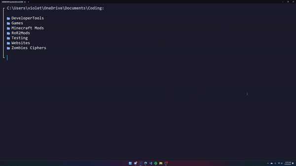

# pls

A pretty LS-like screen for when you cd.



Running `pls` clears the screen and lists files and directories in the current directory, with icons and color information. 

## Installation & Setup

First, install `pls`:

```bash
cargo install cd-pls
```

### Unix

Create a function in your `.bashrc` or somewhere else that's sourced:

```bash
eval $(pls --init)
```

Note that this will automatically override your `cd`, `mv`, `touch`, and `rm` to use `pls`.
