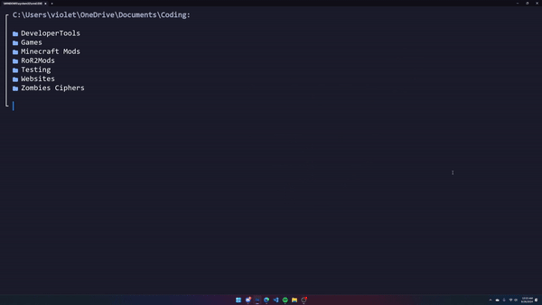

# pls

A pretty LS-like screen for when you cd.



Running `pls` lists files and directories in the current directory, with icons and color information. 

## Installation

`pls` can be installed through `cargo`:

```bash
cargo install cd-pls
```

## Usage

`pls` as a standalone command acts very similar to `ls`:

```bash
pls <DIR>
```

To have `pls` automatically clear the screen and rerun upon directory changes, add the following to your `.bashrc` or somewhere else that's sourced:

```bash
eval "$(pls --init)"
```

Note that this will automatically override your `cd`, `mv`, `touch`, and `rm` to use `pls`.
